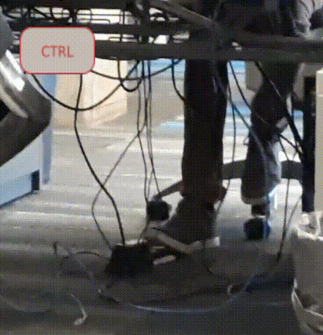

# Pedal Master

A feet operated micro-keyboard design. Now, you can use digital
piano/synthesizer pedals to control your keyboard!

## Motivation
The primary use-case for this is to use pedals to hold modifier keys
such as CTRL, SHIFT and ALT while operating an ordinary keyboard
normally.
For an in-depth explanation of the motivation behind this project, see
[this page](motivation.jpg).

See the
[blogpost](https://ligature.ca/the%20lab/2021/10/29/Writing-code-using-a-foot-pedal.html)
for an overview of the design process.

# Rev2

The latest revision of the Pedal Master is the rev2. See [the buildguide](buildguide/buildguide-rev2.md).
Fabrication files for the PCB and the case are available in this repository.

# Enquiries
Contact me on Github for any enquiries.
