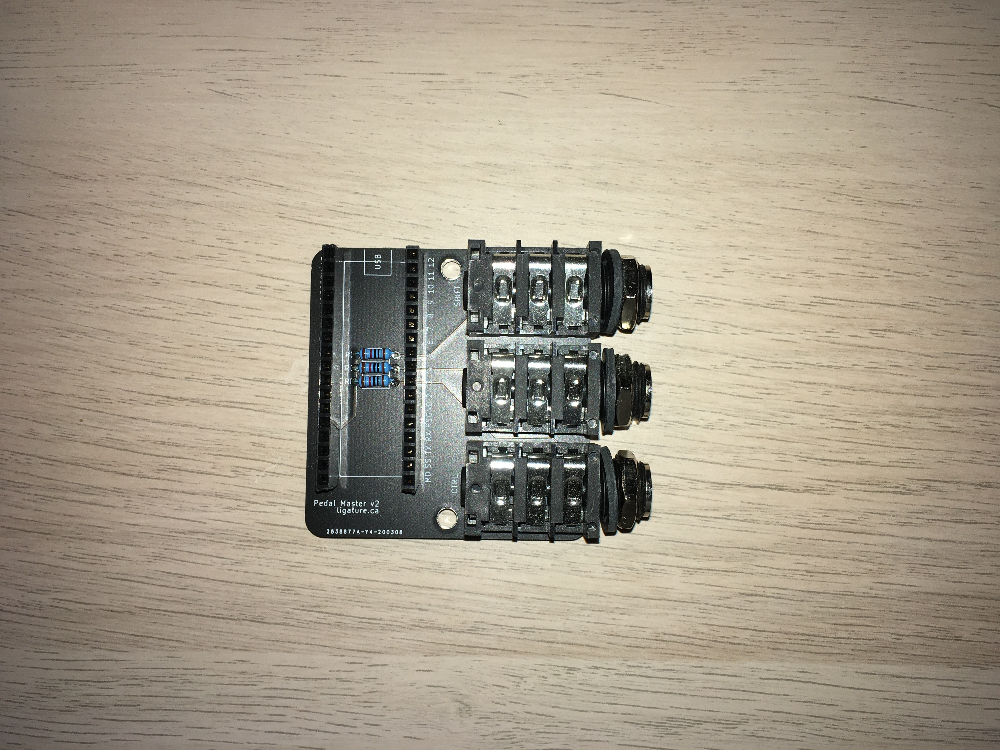

# Build guide

## Parts required
- 1 Pedal master rev2 board
- 3 Amphenol audio 1/4" jack connectors ACJS/ACJM family.
    - Tested with [ACJS-MHDR](https://www.digikey.ca/en/products/detail/amphenol-sine-systems-corp/ACJS-MHDR/7105422)
- 3 10K resistors
- 1 Arduino Micro
- (Recommended) Male-female pin headers for mounting the arduino to the
  PCB. (Standard breadboard sizing.)

## Tools required
- Soldering iron

## Instructions
1. Solder the components to the PCB on the silkscreened side.

2. Edit the firmware file `firmware_rev2.ino` using the Arduino IDE
   and in the config section, set the `INVERTED` config variable to
   true if using inverted pedals. (e.g. Yamaha branded ones.)
   You can also edit what each pedal does by customizing the `KEYS`
   variable. Refer to `Keyboard.h` in the Arduino SDK for available keycodes.

3. Flash the firmware to your Arduino micro.

4. Enjoy your new foot-operated keyboard! Note that no driver is
   required for usage, since the Arduino emulates a standard USB keyboard.
